# 前言

本程序为综合粒子群函数，其完全脱胎于mathworks的particleswarm函数，仅仅结构上与particleswarm类似，设置等操作不需要依赖于particleswarm

暂时不支持PlotFcn绘图，目前只支持将每一次迭代中的最优解单独提出自行plot绘图

由于没有PlotFcn，本函数通过调节"参数设置.xlsx"的'基础部分'中Foreclosure进行强制停止行为，当Foreclosure在任意一次迭代中由FALSE转变成TRUE时，粒子群将在该迭代结束后终止

考虑到可能会设置一个外层嵌套for循环来多次运行粒子群算法，特加入一个保险迭代(Insurance

iteration)来保证避免出现来不及切换Foreclosure而导致直接退出情况，可以在"参数设置.xlsx"中进行修改

综合粒子群算法具有几种在particleswarm函数上并不存在的优化方式，分别为：交叉操作(Cross)、模拟退火接受函数(Anneal)、叠加态变异(Superposition)以及信赖域变异(Trust_region)

以上几种优化方式的参数都可以在"参数设置.xlsx"的Sheet中进行调整

如果需要关闭优化方式，可以去"参数设置.xlsx"中的'基础部分'的Judge进行调整，当Judge为FALSE时，将不会启用该优化。

几种优化方式中：

交叉为对于速度的变异

接受函数的温度并非模拟退火温度，而是一种与迭代次数相挂钩的温度，具体表示为Max_Iteration - Iteration + k，其中k为一个常数，可以在"参数设置"进行调整

叠加态变异是一种和云模型理论相类似的变异方式，具体原理可以参考：论正态云模型的普适性_李德毅

信赖域变异部分偷懒使用fmincon函数进行代笔

两种变异操作策略均为历史最优个体必然进行一次变异，剩下的变异位置留给随机粒子，并且会对速度进行一定的改变，具体变动见函数

每种优化方式都配备了开始迭代，其中交叉和模拟退火接受函数还额外配备了结束迭代，可以在Sheet中进行调整

可以自己添加或者改进任意一优化方式，建议在初始化部分加入自己的新优化方式参数以便检查。

信赖域与叠加态两种优化方式由于是一种必良性的变异操作，需要在变异中计算结果，故每一次变异都具有很大的运算量，建议谨慎使用

本程序的运行时间与particleswarm几乎相同，需要开启并行时可以在"参数设置"的UseParallel中选择TRUE，另外信赖域变异也有并行选项，并行可以极大的节省代码运行时间

本程序还额外支持以迭代次数作为除粒子所代表维度外的额外维进行动态演化的过程，如果需要开启则在Problemtype中选择TRUE，不开启时请务必关闭，若未关闭可能导致迭代次数占用一格输入向量位导致目标函数运行失败

本程序对于原particleswarm的惯性权重方面进行了改动，现在每一个粒子都有对应的惯性，惯性更新公式见updateInertia函数

本程序内并未内置混合函数，可以在函数外嵌套混合函数保证进入局部最优解

# 综合粒子群算法介绍

## 摘要

综合粒子群算法是一种基于粒子群算法并增加几种优化方式的新粒子群算法。综合粒子群算法在粒子群算法的基础上加入了自适应邻域、自适应惯性权重、交叉操作、概率接受最优解、叠加态变异以及信赖域变异，本文围绕后四种优化方式详细展开，综合粒子群算法同时还支持动态问题的最优解，本文讲述如何使用Syntheticpso.m函数对于问题进行求解以及对于Syntheticpso.m函数的参数调整。


*已默认读者了解并可熟练运用粒子群算法(PSO),模拟退火算法(Simulated Annealing)以及遗传算法(Genetic Algorithm)*


## 1. 基础参数设置

由于在第d次迭代时，第i个粒子的速度更新公式如下：
$$
v_{i}^{d}&=&Inertia\times v_{i}^{d-1}\text{自适应惯性部分}
\\
&+&cSelf\times r_1\left( pbest_{i}^{d-1}-x_{i}^{d-1} \right) \text{个体学习部分}
\\
&+&cSocial\times r_2\left( gbest_{i}^{d-1}-x_{i}^{d-1} \right) \text{邻域学习部分}
$$
Syntheticpso.m函数的基础设置包括：


 最大迭代次数(Max Iteration):Syntheticpso.m函数的最大迭代次数


 粒子个数(Swarm Size):一次迭代中粒子的个数

(注意:粒子群复杂度计算公式为
$$
o(Particleswarm) =o(Swarm Size) \times o(Object function) \\\times o(Mutation)
$$
故粒子个数应当控制在合理范围内，式中$o(Mutation)$表示变异所带来的额外复杂度。)


 自适应惯性权重上下界(Inertia):自适应惯性权重的下界和上界(min Inertia 和 max Inertia)


 个人学习因子大小(cSelf):个体学习部分在粒子群中所占据的权重


 社会学习因子大小(cSocial):邻域学习部分在粒子群中所占据的权重


 目标函数理想值(Object Target):所期盼得到的目标函数值(如果为min优化一般会设置为 $ -\infty $ ，如果为max优化一般设置为$\infty$)


 优化选择项目(Judge \_ XXX):选择是否进行优化，$XXX$代表优化类别，具体优化类别见后文介绍，如果想启用优化，请在$Judge \_ XXX$下输入true，不想启用请输入false。

 最小邻域比例(min neighbor):按照比例确定最小的邻域范围，即粒子的最小邻域为($min neighbor \times Swarm Size$)


并行启用(Use Parallel):判断是否启用并行池，如果想启用并行请输入true，如果不想启用并行请输入false。(注意:启用并行后由于CPU核心使用较多可能会出现卡顿情况，并且对于启用并行的函数，读取Excel文档时不能使用xlsread函数并且不能声明全局变量。)


问题类型判断(Problem Type):判断求解问题的类型，若求解问题有额外的与迭代次数相关联的变量$t$导致函数在不同的迭代次数下具有不同的表达式，则该问题类型为动态问题(Dynamic Problem)，若无$t$ 变量则为静态问题。在基础设置中，如果问题类型为动态问题Problem Type = True，如果问题类型为静态问题则Problem Type = False


打印设置(Display):打印粒子群运行状态，若$Display=0$则不打印粒子群运行状态，若$Display = 1$则依据DisplayInterval作为间隔打印粒子群运行状态


打印间隔 DisplayInterval:见上文


由于Syntheticpso.m函数是一个针对动态问题开发的函数，在动态问题下由于目标函数随着迭代次数不断变化故不需要考虑粒子是否收敛，考虑到静态问题下若粒子群已然收敛但是没有收敛判断导致浪费时间与算力，特加入强制停止以及保险迭代功能于基础设置中。


强制停止(Foreclosure):当迭代次数大于等于保险迭代后，可以把强制停止由False改为True对于粒子群进行强制停止，修改后粒子进行完当时所在迭代后将会退出并返回最优解。

保险迭代(Insurance iteration):为防止进入下一次外层迭代或者下一次进行Syntheticpso.m函数时来不及修改强制停止设置而导致第一代就退出，特设置一个保险迭代来预防这种情况的出现。


## 2.综合粒子群算法优化方法

### 交叉

#### 介绍

在综合粒子群算法中，对于全部的$numparticle$个粒子，将会以$P_c$的概率进行交叉，即在每一次迭代中都有$numparticle \times P_c$个粒子执行交叉操作。

交叉函数模仿遗传算法中的交叉操作，对于被选中的粒子$A$和粒子$B$，在其所有的$nvars$个维度中随机选择两个分量$i$和$j$，并且保证$i < j$，对于粒子$A$和粒子$B$的第$i$个分量到第$j$个分量部分进行交叉。操作流程如下

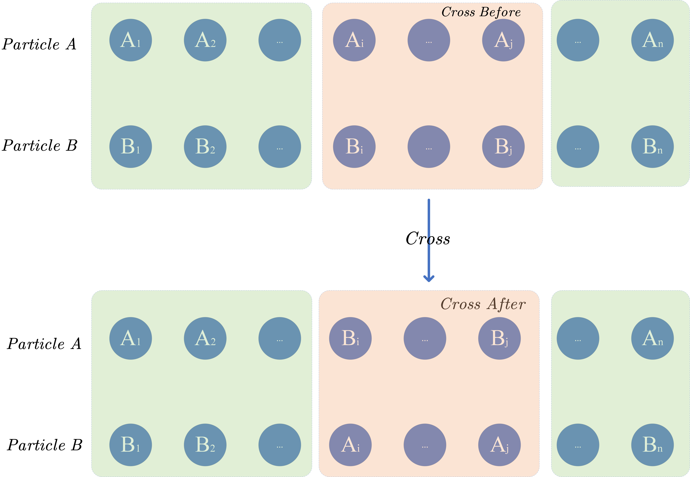

交叉方式的伪代码如Algorithm 1所示

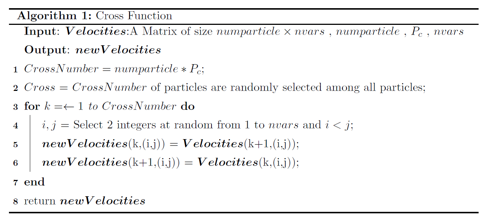

#### 交叉方式的优化原理

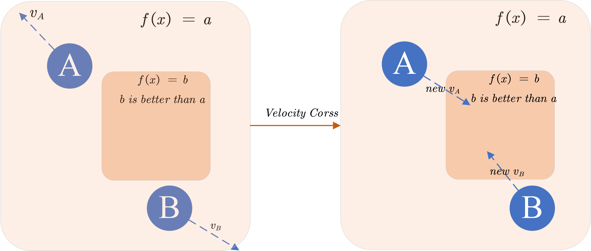

上图是一个问题$f(x)$的解空间等高线图，在同一颜色方框内的粒子具有相同大小的解，$A$和$B$是两个粒子，$v_A$和$v_B$是未进行交叉时粒子$A$和粒子$B$的速度，不难发现如果不进行交叉，粒子$A$和粒子$B$ 将不会经过$f(x)  = b$ 的区域，而对于$v_A$ 和$v_B$ 进行如图所示平面所对应的两个分量的交叉后，$A$和$B$的位置将会更新在$f(x) = b$处，比原来的解更优。所以可以得知交叉方式的优化原理为将两个随机粒子之间的速度进行交叉，让其搜索原轨迹不会搜索的新位置，使解空间得到更加全面地搜索。


### 接受函数

#### 介绍

在综合粒子群算法中，对于新解的接受函数灵感来自于模拟退火的接受函数，根据新旧解的大小，如果新解比旧解更优，则绝对接受新解，如果新解比旧解差，依照概率选择是否接受新解。

接受函数仿照模拟退火算法中的接受函数，但是将其温度改为与迭代次数相挂钩的变量$Max Iteration - Iteration + k$，其中$Max Iteration$是最大迭代次数，$Iteration$是当前迭代次数，$k$是一个用来调整概率的参数。


当新解比旧解差时，接受函数如公式$\ref{equ:1}$所示：
$$
\begin{equation}
p = \frac{1}{1+e^{\frac{\Delta}{Max Iteration - Iteration + k}}}
\label{equ:1}
\end{equation}
$$
式中，$p$为接受概率，$\Delta = \left| NewFval - OldFval\right|$为新旧解之间的差。


接受函数的伪代码如Algorithm 2所示

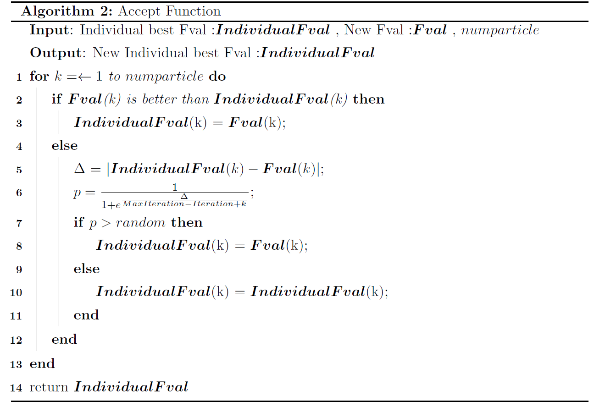

#### 接受函数优化原理

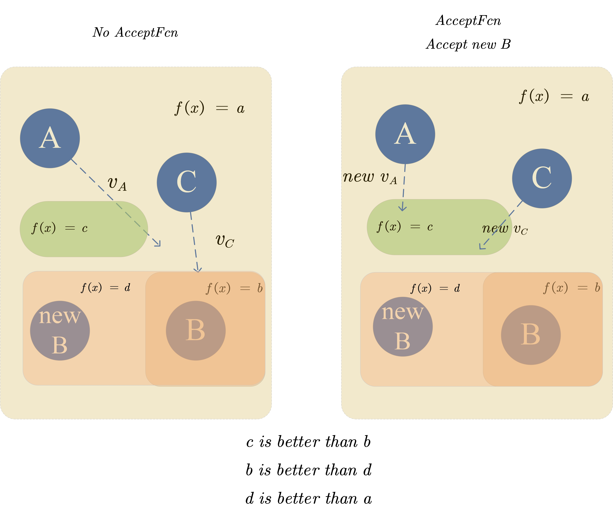

上图是某个问题$f(x)$的解空间等高线图，在该迭代中，粒子$B$的新解$new B$的结果比旧解差，若没有接受函数的存在则会自动接受旧解，$A$和$C$将不会经过$f(x) = c$的情况，即$A$和$C$将不会经过更优解范围，但是若接受了新解$new B$，则会让$A$和$C$在下一次迭代中找到更优解$f(x) = c$，图中仅仅展示了一种寻找到更优解的情况，还有很多使用接受函数得到更优解的情况。使用接受函数后，粒子会有更大的概率去探索其与其邻域内新接受的最优解之间的空间，并且由于概率较小，很多情况下不会发生，对于收敛性不会造成太大波动，这样可以更全面地搜索解空间.


### 叠加态变异

#### 介绍

在综合粒子群算法中，叠加态变异的灵感来自于量子力学中的叠加态，对于某个粒子$A$，以其当前位置$Position_A$为均值，根据某个方差$\sigma ^2$分散成$Superposition$个叠加态粒子，对于所有的叠加态离子，选择最优的那个粒子作为观测态粒子进行坍缩。

#### 原理

对于所有$numParticle$个粒子，依照$P_m$的概率选择$numParticle \times P_m$个粒子进行叠加态变异，被选中的粒子$A$首先保留自己的位置，后生成叠加态粒子集合$Superposition_A = \{A,A_1,A_2,\cdots,A_{Superposition-1}\}$，其中叠加态粒子集合 $ Superposition_A \sim \mathcal{N}(Position_A,\sigma^2)$。计算叠加态集合中每一个粒子所对应的函数值得到集合$Fval.Superposition_A $，该集合中最优解所对应的粒子即为观测态粒子。

由于粒子从叠加态进入观测态时位置与原位置发生了改变，为搜索更优解，对于速度也进行一次修改，对于粒子$A$，将初始状态的粒子$A$记为$initial A$，将最终得到的观测态粒子记为$new A$，为继续搜索观测态方向的解空间，将速度$v_A$以$v_A = Position_{initial A} - Position_{new A}$为更新公式进行变更。


叠加态变异函数的伪代码如Algorithm 3所示:

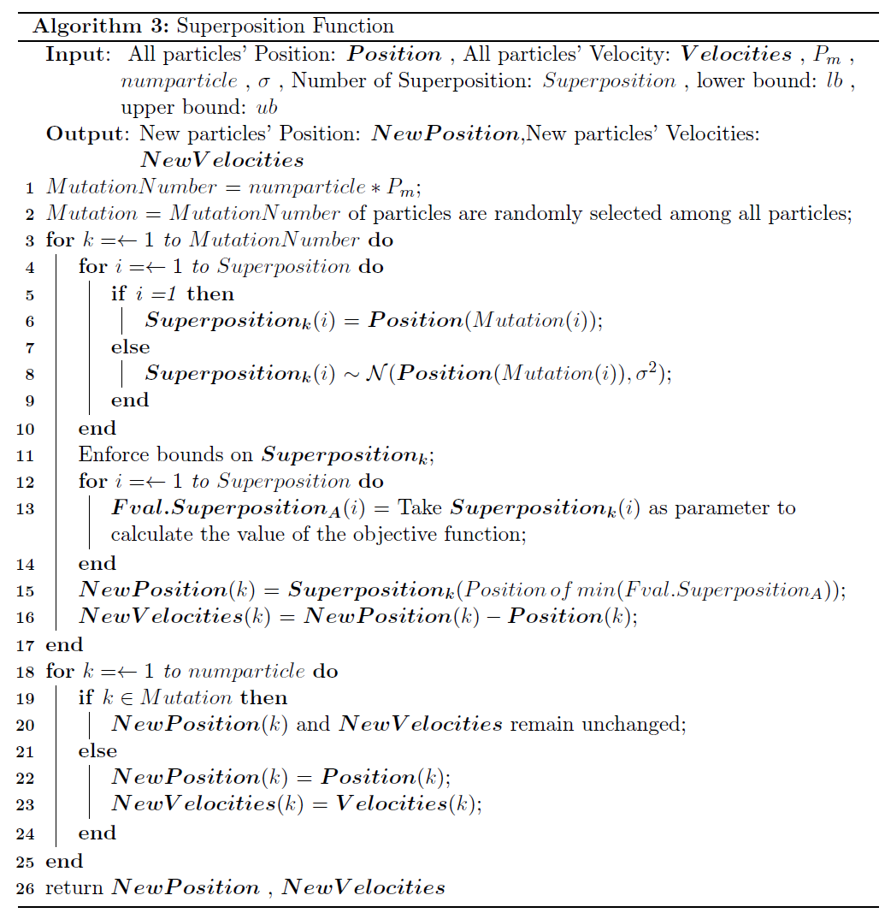

#### 叠加态优化原理

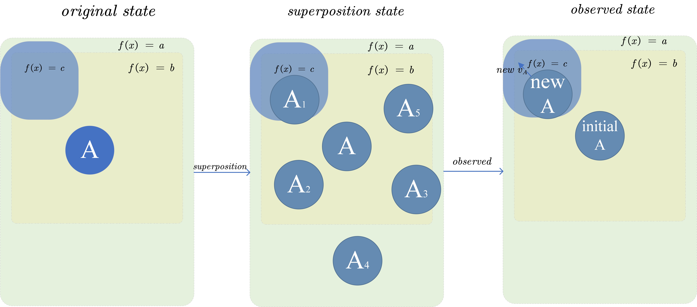

是某个问题$f(x)$的解空间等高线图，自左到右为粒子$A$从初始状态进入叠加态而后又从叠加态转变为观测态的过程，解的优劣关系延续接受函数示意图中解的关系。自左向右粒子$A$先从初始状态依照高斯分布分散出包括自己在内的$6$个叠加态粒子，在被观测时从$6$个叠加态粒子坍缩为观测态粒子$new A$，新速度也为$initial A$到$new A$之间的向量减法。

### 信赖域变异

#### 介绍

信赖域算法是一种求解非线性优化问题的数值方法。信赖域算法是一种迭代算法，即从给定的初始解出发，通过逐步迭代，不断改进，直到获得满意的近似最优解为止。其基本思想是把最优化问题转化为一系列简单的局部寻优问题。

#### 原理

对于一个优化目标函数$f$，设置搜索初值为$\boldsymbol{x_0}$，设置一个信赖域半径$\Delta_0$，最高迭代次数为$N$，开始迭代。


对于第$k$次迭代时，根据此时的信赖域半径$\Delta_k$构建信赖域$\Omega_k = \{x\in R^n | \left\|x - x_k\right\|\leq  \Delta_k\}$。

对于目标函数$f$，其在极值点处近似于二次近似函数$q^{(k)}(s)$，因此对于无约束时，可以利用二次逼近，构造如下的信赖域子问题：
$$
\begin{eqnarray*}
\min\quad q^{(k)}(\boldsymbol{s}) &=& f(\boldsymbol{x_k}) + grad^{T}_{k}\boldsymbol{s} + \frac{1}{2}(\boldsymbol{s}^T H_{k} \boldsymbol{s})\\
s.t. \quad \left\| \boldsymbol{s} \right\| _2  &\leq&  \Delta_k
\end{eqnarray*}
$$
式中，$grad_{k}$是当前目标函数$f$在点$\boldsymbol{x_k}$处的梯度;$\boldsymbol{s} = \boldsymbol{x} - \boldsymbol{x_k}$;$H_k$为$f$在点$\boldsymbol{x_k}$处的$\text{Hesse}$矩阵。


假设$\boldsymbol{s_k}$为该子问题的解。目标函数$f$在第$k$步的实际下降量(观测下降长度)为
$$
\begin{equation}
Ared_k = f(\boldsymbol{x_k}) - f(\boldsymbol{x_k} + \boldsymbol{s_k})
\end{equation}
$$
二次近似函数$q^{(k)}(s)$的预测下降量(预计下降长度)为
$$
\begin{equation}
Pred_k = q^{(k)}(0) - q^{(k)}(\boldsymbol{s_k})
\end{equation}
$$
根据观测下降长度与预测下降长度的比值$r_k$得到评价信赖域在下一次迭代时的半径$\Delta_{k+1}$

若$r_k \rightarrow 1$，则二次近似函数与目标函数的接近程度好。这个时候应当适当扩大信赖域范围。


若$r_k \rightarrow 0$，则二次近似函数与目标函数的接近程度差。这个时候应当适当缩小信赖域范围。

若$r_k$无显著表现，则不改变信赖域范围。

一般而言，当$r_k \geq 0.75$， 认为 $r_k \rightarrow 1$; 当$r_k \leq 0.25$,认为 $r_k \rightarrow 0$。

#### 加入约束条件

若是具有等式约束条件，则可以参考拉格朗日乘数法，构造拉格朗日函数对于近似函数进行改进。

对于具有不等式约束的条件，将会转换成 $\text{Karush-Kuhn-Tucker (KKT) }$方程[1]进行求解。

#### 信赖域变异函数

对于所有$numParticle$个粒子，依照$P_m$的概率选择$numParticle \times P_m$个粒子进行以$Max Iteration$为上限的信赖域变异，为充分搜索解空间，选择其在信赖域中最后一次迭代时的梯度方向作为其变异后的速度方向。

信赖域变异的伪代码如Algorithm 4所示:

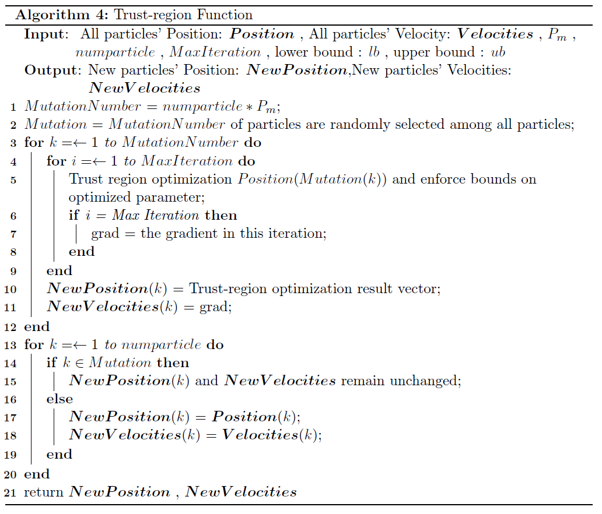

#### 信赖域变异的优化原理

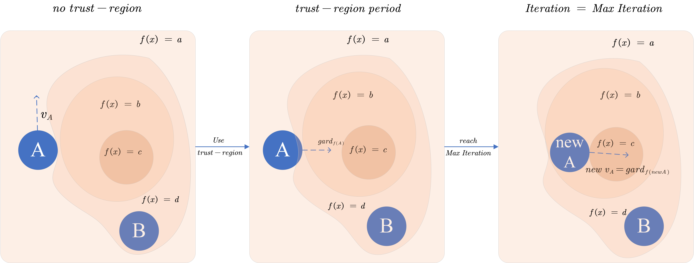

上图是某个问题$f(x)$的解空间等高线图，其中$A$为被选中进行信赖域变异的粒子，$B$为普通粒子，解的优劣仍延续接受函数示意图中解的关系。自左向右看可以发现粒子$A$原本的轨迹中是不会经过可以使用信赖域变异进行优化的解空间，粒子$A$经过信赖域变异后逐步优化最终超过了原本比其更优的粒子$B$，并且因为最大迭代次数的限制无法达到更优解，为搜索可能存在的更优解区域，将最后一次迭代时的梯度方向$grad_{f(new A)}$ 作为粒子的速度。限制最大迭代次数的原因在于避免粒子过早陷入局部最优解。


信赖域变异的原理在于创造了局部最优解对于粒子的牵引能力，使部分原本进行半盲目搜索的粒子可以被解吸引，从而使粒子更为全面并且更为便捷地搜索解空间。

## 参数建议以及缺陷

交叉操作与接受函数的参数调节不当可能会导致无法产生更优解，建议$P_c = 0.15$，$k = 300$。

两种变异操作的算法复杂度极高，对于算法的运行速度具有着极大的影响。建议在控制好各个参数的前提下使用。
$$
\begin{eqnarray*}
o(trust-region) &=& o(Object Function) \times (1 + MaxIteration \times (P_m \times numparticle)) \\
o(Superposition) &=& o(Object Function) \times (1 + Superposition \times (P_m \times numparticle))
\end{eqnarray*}
$$


# 代码实现

## 主函数

```matlab
function [x,fval,Best] = Syntheticpso(fun, nvars, lb, ub)
%% 初始化部分

  %% 初始粒子设置
InitialSwarmMatrix = readmatrix("参数设置",'Sheet','初始粒子');% 没有初始粒子会自动生成，生成方法为creationfcn
  %% options结构体设置
Syntheticpso = readmatrix('参数设置.xlsx','Sheet','基础部分');%读取粒子群参数
  %% 基础部分
Max_Iteration = Syntheticpso(1);%最大迭代次数
Min_Inertia = Syntheticpso(2);  %自适应惯性下界
Max_Inertia = Syntheticpso(3);  %自适应惯性上界
cSocial = Syntheticpso(4);      %社会学习因子
cSelf = Syntheticpso(5);        %自我学习因子
Swarsize = Syntheticpso(6);     %粒子个数
ObjectTarget = Syntheticpso(7); %理想函数值
  %% 优化部分
Judge_trust = Syntheticpso(8);          %是否启用信赖域变异
Judge_cross = Syntheticpso(9);          %是否启用交叉
Judge_anneal = Syntheticpso(10);        %是否启用退火接受函数
Judge_superposition = Syntheticpso(11);%是否启用叠加态变异
Min_neighbor = Syntheticpso(12);        %自适应邻域下界
    %% 信赖域变异设置
    trust_region = readmatrix('参数设置.xlsx','Sheet','trust_region');%读取信赖域变异参数

    MaxIter = trust_region(1);              %设置信赖域迭代次数
    Pm = trust_region(2);                   %设置变异概率
    Mut_Start_Iteration = trust_region(3);  %设置变异开始时间
    Tolcon = trust_region(4);               %设置信赖域判定epsilon收敛范围
    UseParallel = trust_region(5);          %设置是否启用并行

    trust_region = struct( ...                        设置信赖域变异结构体
        'Judge_trust_region',Judge_trust, ...         设置信赖域启用判定
        'MaxIteration',MaxIter, ...                   设置信赖域最大迭代次数
        'Pm',Pm, ...                                  设置信赖域变异概率
        'Mut_Start_Iteration',Mut_Start_Iteration, ...设置变异开始迭代
        'Tolcon',Tolcon, ...                           设置信赖域收敛判定范围
        'UseParallel',UseParallel ...                  设置是否启用并行
     );
    %% 交叉设置
    Cross = readmatrix('参数设置.xlsx','Sheet','Cross');%读取交叉参数

    Pc = Cross(1);             %设置交叉概率
    Start_Iteration = Cross(2);%设置交叉起始迭代
    End_Iteration = Cross(3);  %设置交叉终止迭代

    Cross = struct( ...                       设置交叉结构体
        'Judge_Cross',Judge_cross, ...        设置交叉启用判定
        'Pc',Pc, ...                          设置交叉率
        'Start_Iteration',Start_Iteration, ...设置交叉起始迭代
        'End_Iteration',End_Iteration ...     设置交叉终止迭代
        );
    %% 退火接受函数设置
    Anneal = readmatrix('参数设置.xlsx','Sheet','Anneal');%读取退火接受函数参数

    k = Anneal(1);              %设置模拟退火参数   
    Start_Iteration = Anneal(2);%设置接受起始迭代
    End_Iteration = Anneal(3);  %设置接受终止迭代

    Anneal = struct( ...                      设置接受函数结构体
        'Judge_Anneal',Judge_anneal, ...      设置接受函数启用判定
        'k',k, ...                            设置退火参数
        'Start_Iteration',Start_Iteration, ...设置接受起始迭代
        'End_Iteration',End_Iteration ...     设置接受终止迭代
        );
    %% 叠加态变异设置
    Superposition = readmatrix('参数设置.xlsx','Sheet',' Superposition');%读取叠加态变异参数

    numSuperposition = Superposition(1);  %设置叠加态个数
    sigma = Superposition(2);              %设置叠加态方差
    Pm = Superposition(3);                 %设置变异率
    Mut_Start_Iteration = Superposition(4);%设置变异开始迭代

    Superposition = struct( ...                        设置接受函数结构体
        'Judge_Superposition',Judge_superposition, ... 设置叠加态启用判定
        'numSuperposition',numSuperposition, ...       设置叠加态个数
        'sigma',sigma, ...                             设置叠加态方差
        'Pm',Pm, ...                                   设置变异率
        'Mut_Start_Iteration',Mut_Start_Iteration ...  设置变异起始迭代
        );
  %% 其他设置
UseParallel = Syntheticpso(13);         %是否启用并行
Problemtype = Syntheticpso(14);         %函数问题类型，如果为动态问题则为TRUE，静态问题则选择FALSE
Display = Syntheticpso(15);             %设置显示结果，如果为0则不显示，如果为1则显示最后一代，如果为2则显示若干代
InitialSwarmSpan = Syntheticpso(16);    %设置初始粒子范围
DisplayInterval = Syntheticpso(17);     %迭代次数间隔
StallIterLimit = Syntheticpso(18);      %显示窗口设置有关的参数(不是Plot)
Insurance_Iteration = Syntheticpso(19); %保险迭代窗口期设置


options = struct( ...% 设置结构体options
    'Max_Iteration',Max_Iteration, ...              设置最大迭代次数Max_Iteration
    'InertiaRange',[Min_Inertia,Max_Inertia], ...   设置自适应惯性上下界
    'cSocial',cSocial, ...                          设置社会学习因子
    'cSelf',cSelf, ...                              设置自我学习因子
    'Swarmsize',Swarsize, ...                       设置粒子个数
    'initialSwarmSpan',InitialSwarmSpan,...         设置粒子范围
    'initialSwarmMatrix',InitialSwarmMatrix,...     设置初始粒子
    'StallIterLimit',StallIterLimit,...             设置显示窗口设置有关的参数(不是Plot)
    'ObjectTarget',ObjectTarget, ...                设置目标函数值
    'Trust_region',trust_region, ...                设置信赖域变异
    'Cross',Cross, ...                              设置交叉
    'Anneal',Anneal,...                             设置接受函数
    'Superposition', Superposition,...              设置叠加态
    'Min_neighbor',Min_neighbor, ...                设置最小邻域半径
    'UseParallel',UseParallel, ...                  设置是否启用并行
    'Problemtype',Problemtype, ...                  设置问题类型
    'Verbosity',Display, ...                        设置显示格式    
    'DisplayInterval',DisplayInterval, ...          设置输出间隔
    'Insurance_Iteration',Insurance_Iteration ...   设置保险迭代期
    );
[x,fval,Best] = Core(fun,nvars,lb,ub,options);
end
```

## 核心函数Core

```matlab
function [x,fval,Best] = Core(fun,nvars,lb,ub,options)
%% 赋值阶段
pIdx = 1:options.Swarmsize;
exitFlag=[];
numParticles = options.Swarmsize;
minInertia = options.InertiaRange(1);
maxInertia = options.InertiaRange(2);
minNeighborhoodSize = max(2,floor(numParticles*options.Min_neighbor));
adaptiveNeighborhoodSize = minNeighborhoodSize;
%% 初始化阶段
state = makeState(nvars,lb,ub,fun,options);
bestFvals = min(state.Fvals);
bestFvalsWindow = nan(options.StallIterLimit, 1);

adaptiveInertiaCounter = 0;
%% 设置初始化惯性
if all(options.InertiaRange >= 0)
    adaptiveInertia = maxInertia*ones(numParticles,1);
elseif all(options.InertiaRange <= 0)
    adaptiveInertia = minInertia*ones(numParticles,1);
else
end

%% 设置显示部分
% Setup display header
if  options.Verbosity > 1
    fprintf('\n                                 Best            Mean     Stall\n');
    fprintf(  'Iteration     f-count            f(x)            f(x)    Iterations\n');
    fprintf('%5.0f         %7.0f    %12.4g    %12.4g    %5.0f\n', ...
        0, state.FunEval, bestFvals, mean(state.Fvals), 0);
end


i = 1;%记录迭代次数
while isempty(exitFlag)
    state.Iteration = state.Iteration + 1;
        % 更新邻域向量
        bestNeighborIndex = generateBestNeighborIndex(state,adaptiveNeighborhoodSize,numParticles);
        
        % 更新速度与位置
        state = updateParticles(state,adaptiveInertia,bestNeighborIndex,pIdx,numParticles,nvars,lb,ub,fun,options);
        

        % 求解粒子
        if options.Problemtype == false% 判断是否为动态问题
            state.Fvals = slove(state.Positions, fun, 1, options);
        else
            state.Fvals = slove([state.Positions,state.Iteration*ones(numParticles,1)],fun,1,options);
        end

        % 更新
        state = updateState(state,numParticles,pIdx,options);
        
        bestFvalsWindow(1+mod(state.Iteration-1,options.StallIterLimit)) = min(state.IndividualBestFvals);
        % 自适应惯性更新
        [state,adaptiveInertiaCounter,bestFvals,adaptiveNeighborhoodSize,adaptiveInertia] = updateInertia(state,options,bestFvals,adaptiveInertiaCounter,adaptiveNeighborhoodSize,adaptiveInertia,numParticles,minNeighborhoodSize);
        
        % 结束判断
        [exitFlag] = stopCore(options,state,bestFvalsWindow);
        [Bestfval(i),Posi] = min(state.Fvals);
        Best(i) = min(state.IndividualBestFvals);
        BestPosition(i,:) =  min(state.Positions(Posi));
        i = i+1;

end
if options.Problemtype == false %如果为静态问题，则为个体历史最优
        [fval,indexBestFval] = min(state.IndividualBestFvals);
        x = state.IndividualBestPositions(indexBestFval,:);
else%如果为动态问题，则需要将每一代都提出来
        x = BestPosition;
        fval = Bestfval;
        Best = Bestfval;

end
end
```

## 次级函数

### 初始化结构体

```matlab
function state = makeState(nvars,lb,ub,fun,options)
% 创建初始上下界
lbMatrix = repmat(lb,options.Swarmsize,1);
ubMatrix = repmat(ub,options.Swarmsize,1);
% 创建初始结构体
state = struct;
state.Iteration = 0; % current generation counter
state.StartTime = tic; % tic identifier
state.StopFlag = false; % OutputFcns flag to end the optimization
state.LastImprovement = 1; % generation stall counter
state.LastImprovementTime = 0; % stall time counter
state.FunEval = 0;
numParticles = options.Swarmsize;

%% 初始化
    problemStruct = struct( ...
        'objective',fun, ...
        'lb',lb, ...
        'ub',ub, ...
        'nvars',nvars, ...
        'options',options ...
        );
    state.Positions = CreationFcn(problemStruct);

%% 边界约束
if any(any(state.Positions < lbMatrix)) || any(any(state.Positions > ubMatrix))
    state.Positions = max(lbMatrix, state.Positions);
    state.Positions = min(ubMatrix, state.Positions);
end

% 随机采样生成速度
vmax = min(ub-lb, options.initialSwarmSpan);
state.Velocities = repmat(-vmax,numParticles,1) + ...
    repmat(2*vmax,numParticles,1) .* rand(numParticles,nvars);

if options.Problemtype == false %如果不带时变
    fvals = slove(state.Positions(1:end,:),fun,1,options);
    state.Fvals = fvals;
else% 带时变
    fvals = slove([state.Positions(1:end,:),state.Iteration*ones(options.Swarmsize,1)],fun,1,options);%加入一个和迭代次数相关的时间作为变量的一部分
    state.Fvals =  fvals;  
end

state.FunEval = numParticles;

state.IndividualBestFvals = state.Fvals;
state.IndividualBestPositions = state.Positions;
end 
```

#### 生成初始化粒子函数

```matlab
function swarm = CreationFcn(problemStruct)

nvars = problemStruct.nvars;
options = problemStruct.options;

[lb,ub] = determinePositionInitBounds(problemStruct.lb, problemStruct.ub, ...
    options.initialSwarmSpan);

numParticles = options.Swarmsize;
numInitPositions = size(options.initialSwarmMatrix, 1);
numPositionsToCreate = numParticles - numInitPositions;

%% 创建初始化粒子
swarm = zeros(numParticles,nvars);

%% 手动输入粒子部分
if numInitPositions > 0
    swarm(1:numInitPositions,:) = options.InitialSwarm;
end

% Create remaining particles, randomly sampling within lb and ub
span = ub - lb;
swarm(numInitPositions+1:end,:) = repmat(lb,numPositionsToCreate,1) + ...
    repmat(span,numPositionsToCreate,1) .* rand(numPositionsToCreate,nvars);

end
```

#### 确定初始位置上下界函数

```matlab
function [lb,ub] = determinePositionInitBounds(lb,ub,initialSwarmSpan)

lbFinite = isfinite(lb);
ubFinite = isfinite(ub);
lbInf = ~lbFinite;
ubInf = ~ubFinite;

% 如果上下界皆有限直接继续.

% 如果上下界均无限，以0作为起始点
idx = lbInf & ubInf;
lb(idx) = -initialSwarmSpan(idx)/2;
ub(idx) = initialSwarmSpan(idx)/2;

% 如果只有下界是有限的，以下界作为起始范围
idx = lbFinite & ubInf;
ub(idx) = lb(idx) + initialSwarmSpan(idx);

% 如果只有上界是有限的，以上界作为起始范围
idx = lbInf & ubFinite;
lb(idx) = ub(idx) - initialSwarmSpan(idx);
end
```

### 邻域更新函数

```matlab
function bestNeighborIndex = generateBestNeighborIndex(state,adaptiveNeighborhoodSize,numParticles)

neighborIndex = zeros(numParticles, adaptiveNeighborhoodSize);%建立邻居矩阵

neighborIndex(:,1) = 1:numParticles; % 第一个邻居是自己

for i = 1:numParticles
    %% 确定排除粒子本身的随机邻居,即(numParticles-1)粒子
    neighbors = randperm(numParticles-1, adaptiveNeighborhoodSize-1);
    %% 对于>=当前粒子索引的索引加上1
    iShift = neighbors >= i;
    neighbors(iShift) = neighbors(iShift) + 1;
    neighborIndex(i,2:end) = neighbors;
end
%% 寻找邻域中的最优点
[~, bestRowIndex] = min(state.IndividualBestFvals(neighborIndex), [], 2);


bestLinearIndex = (bestRowIndex.'-1).*numParticles + (1:numParticles);
bestNeighborIndex = neighborIndex(bestLinearIndex);
end
```

### 粒子更新函数

```matlab
function state =  updateParticles(state,adaptiveInertia,bestNeighborIndex,pIdx,numParticles,nvars,lb,ub,fun,options)
% 速度更新
state.Velocities(pIdx,:) = updateVelocities(state,adaptiveInertia,bestNeighborIndex,pIdx,nvars,options);
% 位置更新
[state.Positions(pIdx,:),tfInvalid] = updatePositions(state,lb,ub,pIdx,numParticles,nvars,fun,options);
% 速度修正
if any(tfInvalid(:))
    state.Velocities(tfInvalid) = 0;
end
end
```

#### 速度更新函数

```matlab
function newVelocities = updateVelocities(state,adaptiveInertia,bestNeighborIndex,pIdx,nvars,options)

  %% 生成随机因子
randSelf = rand(numel(pIdx),nvars);
randSocial = rand(numel(pIdx),nvars);
%% 读取旧速度
oldVelocities = state.Velocities(pIdx,:);
  %%  速度更新公式
newVelocities = adaptiveInertia.*oldVelocities + ...旧速度部分
    options.cSelf*randSelf.*(state.IndividualBestPositions(pIdx,:)-state.Positions(pIdx,:)) + ...自我认知部分
    options.cSocial*randSocial.*(state.IndividualBestPositions(bestNeighborIndex(pIdx), :)-state.Positions(pIdx,:));%社会认知部分

  %%   交叉阶段
  if options.Cross.Judge_Cross == true %判断是否进行交叉
       if state.Iteration >= options.Cross.Start_Iteration
          if state.Iteration <= options.Cross.End_Iteration
           newVelocities = Crossfunction(newVelocities,pIdx,nvars,options);%进行交叉操作
          end
       end
  end
  %% 忽视速度无穷的情况
tfInvalid = ~all(isfinite(newVelocities), 2);
newVelocities(tfInvalid) = oldVelocities(tfInvalid);
end
```

##### 交叉函数

```matlab
function newVelocities = Crossfunction(newVelocities,pIdx,nvars,options)
CrossNumber = randperm(numel(pIdx),round(numel(pIdx)*options.Cross.Pc));%设置交叉个体
CrossNumber = sort(CrossNumber);%对其进行升序排序
for i = 1:numel(CrossNumber)-1
CrossPosition = randperm(nvars,2);%在粒子中选择两个点位对其中间部分进行交叉
CrossPosition = sort(CrossPosition);%对其进行升序排序
a = CrossPosition(1);
b = CrossPosition(2);
temp=newVelocities(CrossNumber(i),(a:b));
newVelocities(CrossNumber(i),(a:b))=newVelocities(CrossNumber(i+1),(a:b));
newVelocities(CrossNumber(i+1),(a:b))=temp;
end
end
```

#### 位置更新函数

```matlab
function [newPositions,tfInvalid] = updatePositions(state,lb,ub,pIdx,numParticles,nvars,fun,options)
lbMatrix = repmat(lb,options.Swarmsize,1);
ubMatrix = repmat(ub,options.Swarmsize,1);
  %% 更新位置
  newPositions = state.Positions(pIdx,:) + state.Velocities(pIdx,:);
  %% 去除大小为无穷的位置
  tfInvalid = any(~isfinite(newPositions), 2);
  tfInvalidFull = false(numParticles, 1);
  tfInvalidFull(pIdx) = tfInvalid;
  newPositions(tfInvalid, :) = state.Positions(tfInvalidFull, :);

  %% 边界约束
  tfInvalidLB = newPositions < lbMatrix(pIdx,:);
  if any(tfInvalidLB(:))
    tfInvalidLBFull = false(numParticles,nvars);
    tfInvalidLBFull(pIdx,:) = tfInvalidLB;
    newPositions(tfInvalidLB) = lbMatrix(tfInvalidLBFull);
    
    tfInvalid = tfInvalidLBFull;
  else
    tfInvalid = false(numParticles,nvars);
  end

  tfInvalidUB = newPositions > ubMatrix(pIdx,:);
  if any(tfInvalidUB(:))
    tfInvalidUBFull = false(numParticles,nvars);
    tfInvalidUBFull(pIdx,:) = tfInvalidUB;
    newPositions(tfInvalidUB) = ubMatrix(tfInvalidUBFull);
    
    tfInvalid = tfInvalid | tfInvalidUBFull;
  end
  %% 变异阶段
  % 信赖域变异
  if options.Trust_region.Judge_trust_region == true%判断是否进行信赖域变异
     newPositions = Mut_Trust_region(state,fun,newPositions,pIdx,lb,ub,options,nvars);%信赖域变异
  end
  % 叠加态变异
  if options.Superposition.Judge_Superposition == true%判断是否进行叠加态变异
      newPositions = Mut_Superposition(state,nvars,fun,newPositions,pIdx,lb,ub,options);%进行叠加态变异
  end
end
```

##### 变异

###### 信赖域变异

```matlab
    %% 动态问题时间不变约束
function [c,ceq] = nonlcon(par)
load I

c = [];
ceq = [par(end)-I.state.Iteration];
end

  function newPositions = Mut_Trust_region(state,fun,newPositions,pIdx,lb,ub,options,nvars)
if state.Iteration <= options.Trust_region.Mut_Start_Iteration
    Pm = 0;
else
    Pm = options.Trust_region.Pm;
end

 MutationNumber = randperm(numel(pIdx),round(numel(pIdx)*Pm));%设置变异个体
 if options.Problemtype == false
for i=1:numel(MutationNumber)% 每次变异都选择一个最优剩下几个变异名额选择随机个体
    [~,MinFvalPosition] = min(state.IndividualBestFvals);
    if MutationNumber(i) == MinFvalPosition
        continue
    elseif i == numel(MutationNumber)
        MutationNumber(i) = MinFvalPosition;
    else
        continue
    end
end
 else
     for i=1:numel(MutationNumber)% 每次变异都选择一个最优剩下几个变异名额选择随机个体
    [~,MinFvalPosition] = min(state.Fvals);
    if MutationNumber(i) == MinFvalPosition
        continue
    elseif i == numel(MutationNumber)
        MutationNumber(i) = MinFvalPosition;
    else
        continue
    end
     end
end

 MutationNumber = sort(MutationNumber);%对其进行升序排序

     options.Trust_region.UseParallel = logical( options.Trust_region.UseParallel);

    opts = optimoptions('fmincon', ...%
    'TolCon',options.Trust_region.Tolcon, ...%
    'MaxFunEvals',options.Trust_region.MaxIteration, ...%
    'UseParallel', options.Trust_region.UseParallel, ...%
    'Algorithm','sqp', ...%
    'Display','none' ...%
    );
if options.Problemtype == false%静态无时变问题
    for i=1:numel(MutationNumber)% 开始信赖域自搜索变异
       [newPositions(MutationNumber(i),:),~,~,~,~,Velocities,~] = fmincon( fun,newPositions(MutationNumber(i),:),[],[],[],[],lb,ub,[],opts);
       newVelocities =Velocities';
       state.Velocities(MutationNumber(i),:) = newVelocities;
    end
else%动态问题，加入state.Iteration作为时间变量
     I = struct('nvars',nvars,'state',state);
     save I
    for i=1:numel(MutationNumber)% 开始信赖域自搜索变异
        [Positions,~,~,~,~,Velocities,~] = fmincon( fun,[newPositions(MutationNumber(i),:),state.Iteration],[],[],[],[],[lb,0],[ub,options.Max_Iteration],@nonlcon,opts);
        newPositions(MutationNumber(i),:) = Positions(1:end-1);
        Velocities = Velocities';
        state.Velocities(MutationNumber(i),:) = Velocities(1:end-1);

    end
end
end
```

###### 叠加态变异

```matlab
function newPositions = Mut_Superposition(state,nvars,fun,newPositions,pIdx,lb,ub,options)
lbMatrix = repmat(lb,options.Swarmsize,1);
ubMatrix = repmat(ub,options.Swarmsize,1);
if state.Iteration <= options.Superposition.Mut_Start_Iteration
    Pm = 0;
else
    Pm = options.Superposition.Pm;
end


sigma = options.Superposition.sigma;
    if numel(sigma) >=2
    else
        sigma = sigma*(ones(1,nvars));
    end


numSuperposition = options.Superposition.numSuperposition;


 MutationNumber = randperm(numel(pIdx),round(numel(pIdx)*Pm));%设置变异个体


 if options.Problemtype == false
for i=1:numel(MutationNumber)% 每次变异都选择一个最优剩下几个变异名额选择随机个体
    [~,MinFvalPosition] = min(state.IndividualBestFvals);
    if MutationNumber(i) == MinFvalPosition
        continue
    elseif i == numel(MutationNumber)
        MutationNumber(i) = MinFvalPosition;
    else
        continue
    end
end
 else
     for i=1:numel(MutationNumber)% 每次变异都选择一个最优剩下几个变异名额选择随机个体
    [~,MinFvalPosition] = min(state.Fvals);
    if MutationNumber(i) == MinFvalPosition
        continue
    elseif i == numel(MutationNumber)
        MutationNumber(i) = MinFvalPosition;
    else
        continue
    end
     end
end
   for i=1:numel(MutationNumber)% 开始叠加态变异
       if options.UseParallel == true
       for j=1:numSuperposition
           if j == 1
               Superposition(j,:) = newPositions(MutationNumber(i),:);% 保留原位置
          else
               Superposition(j,:) = normrnd(newPositions(MutationNumber(i),:) ,sigma,1,nvars);% 将其他位置以sigma作为方差升级为叠加态位置
           end
       end
       else
           for j=1:numSuperposition
           if j == 1
               Superposition(j,:) = newPositions(MutationNumber(i),:);% 保留原位置
          else
               Superposition(j,:) = normrnd(newPositions(MutationNumber(i),:) ,sigma,1,nvars);% 将其他位置以sigma作为方差升级为叠加态位置
           end
           end
       end
       a = linspace(1,numSuperposition,numSuperposition); % 对于叠加态粒子个数进行拆分
       Invalid = any(~isfinite(Superposition), 2);
       tfInvalidFull = false(numSuperposition, 1);
       tfInvalidFull(a) = Invalid;
       Superposition(Invalid, :) = state.Positions(tfInvalidFull, :);
        lbMatrix = repmat(lbMatrix(1,:),numSuperposition,1);
        ubMatrix = repmat(ubMatrix(1,:),numSuperposition,1);
% Enforce bounds on positions and return logical array to update velocities where position exceeds bounds.
       tfInvalidLB = Superposition < lbMatrix(a,:);
      if any(tfInvalidLB(:))
        tfInvalidLBFull = false(numSuperposition,nvars);
         tfInvalidLBFull(a,:) = tfInvalidLB;
        Superposition(tfInvalidLB) = lbMatrix(tfInvalidLBFull);
        Invalid = tfInvalidLBFull;
      else
        Invalid = false(numSuperposition,nvars);
      end
   tfInvalidUB = Superposition > ubMatrix(1,:);
  if any(tfInvalidUB(:))
    tfInvalidUBFull = false(numSuperposition,nvars);
    tfInvalidUBFull(a,:) = tfInvalidUB;
    Superposition(tfInvalidUB) = ubMatrix(tfInvalidUBFull);
  end


  if options.Problemtype ==false
      Fvals(a) = slove( Superposition, fun, 1, options);  % 求出所有叠加态的解
  else
      Fvals(a) = slove([Superposition,state.Interation*ones(numSuperposition,1)],fun,1,options);

  end
        [~,Posi]=min(Fvals);%选取最优解，即进行观测坍缩
        state.Velocities(MutationNumber(i),:) = newPositions(MutationNumber(i),:) - Superposition(Posi,:);
        newPositions(MutationNumber(i),:)=Superposition(Posi,:);%最优解导回原位置

   end
end
```

### 求解函数

```matlab
function y = slove(pop,fun,numObj,options)
 popSize = size(pop,1);
 y = zeros(popSize,numObj);
 if options.UseParallel ==true% 判断是否使用并行
 parfor (i = 1:popSize)
  y(i,:) = feval(fun,(pop(i,:)));
 end
 else
  for i = 1:popSize
  y(i,:) = feval(fun,(pop(i,:)));
  end
 end
end
```

### 结构体state更新最优位置与结果

```matlab
function state = updateState(state,numParticles,pIdx,options)

state.FunEval = state.FunEval + numel(pIdx);

%% 接受函数
tfImproved = false(numParticles,1);
  if options.Anneal.Judge_Anneal == true%判断是否启用模拟退火接受函数
      if state.Iteration >= options.Anneal.Start_Iteration
          if state.Iteration <= options.Anneal.End_Iteration
      
          tfImproved = AnnealAcceptfunction(state,options);%模拟退火接受函数
          tfImproved = tfImproved';
          tfImproved = logical(tfImproved);
          end
      end

  else
    tfImproved(pIdx) = state.Fvals(pIdx) < ...
    state.IndividualBestFvals(pIdx);%原接受函数
  end
  %% 接受新解
  state.IndividualBestFvals(tfImproved) = state.Fvals(tfImproved);%更新值
  state.IndividualBestPositions(tfImproved, :) = state.Positions(tfImproved, :);%更新位置
end
```

#### 接受函数

```matlab
function tfImproved = AnnealAcceptfunction(state,options)
for i=1:numel(state.Fvals)
    if state.Fvals(i) < state.IndividualBestFvals(i)
        tfImproved(i) = 1;
    else
      delE = state.Fvals(i) - state.IndividualBestFvals(i);
      h = 1/(1+exp(delE/(options.Max_Iteration - state.Iteration + options.Anneal.k)));%接受函数
            if h > rand
        tfImproved(i) = 1;
    else
        tfImproved(i) = 0;
            end
    end
end
end
```

### 粒子群停止条件函数

```matlab
function [exitFlag] = stopCore(options,state,bestFvalsWindow)
iteration = state.Iteration;

if options.Problemtype == true
   bestFval = min(state.Fvals);
else
    iterationIndex = 1+mod(iteration-1,options.StallIterLimit);
    bestFval = bestFvalsWindow(iterationIndex);
end
if options.Verbosity > 1 && ...
        mod(iteration,options.DisplayInterval)==0 && ...
        iteration > 0
    FunEval  = state.FunEval;
    MeanFval = meanf(state.Fvals);
    StallGen = iteration  - state.LastImprovement;
    fprintf('%5.0f         %7.0f    %12.4g    %12.4g    %5.0f\n', ...
        iteration, FunEval, bestFval, MeanFval, StallGen);
end
Zne = readmatrix('参数设置.xlsx','Sheet','基础部分');
Foreclosure = Zne(20);%设置强制退出
reasonToStop = '';
exitFlag = [];
if state.Iteration >= options.Insurance_Iteration
    if state.Iteration >= options.Max_Iteration
        exitFlag = 0;
    elseif Foreclosure == true %强制退出
        exitFlag = 1;
    end
end

if ~isempty(reasonToStop) && options.Verbosity > 0
    return
end

% 重新打印
if options.Verbosity > 1 && rem(iteration,30*options.DisplayInterval)==0 && iteration > 0
    fprintf('\n                                 Best            Mean     Stall\n');
    fprintf('Iteration     f-count            f(x)            f(x)    Iterations\n');
end

end
```

#### 均值函数

```matlab
function m = meanf(x)
tfValid = ~isnan(x);
n = sum(tfValid);
if n==0
    % 避免出现m/0的情况
    m = NaN;
else
    m = sum(x(tfValid)) ./ n;
end
end 
```

# 动态问题

## 问题介绍

考虑目标函数$f(\boldsymbol{x},t)$，其中$\boldsymbol{x}$为需要优化的向量，$t$为一个与$x$无关并且只和时间有关的额外维度，要求在$t$不断变动的前提下尽量得到每一个$t$下的参数$\boldsymbol{x}_t$使其能够让$f(\boldsymbol{x},t)$最优。

## 对于动态问题的求解

由于$t$是一个只与时间有关而与$\boldsymbol{x}$无关的一个额外维度，所以不妨将粒子群算法的迭代次数$Iteration$引入充当一个时间维度。

如何求解这样一个$f(\boldsymbol{x},t)$呢?可以将迭代次数扩充进粒子中进行求解。

对于求解器solve进行如Algorithm 5所示伪代码的改动:

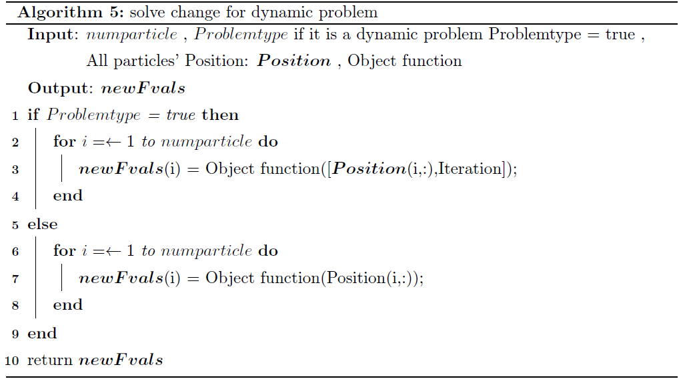

更新求解器$solve$后便可以对于目标问题进行优化求解，并且可以使用交叉操作、接受函数以及叠加态变异三种优化方式。


对于信赖域变异，由于信赖域算法与普通求解器不同，所以需要对其求解器进行额外改造

对于信赖域变异函数，进行如Algorithm 6所示伪代码的改动:

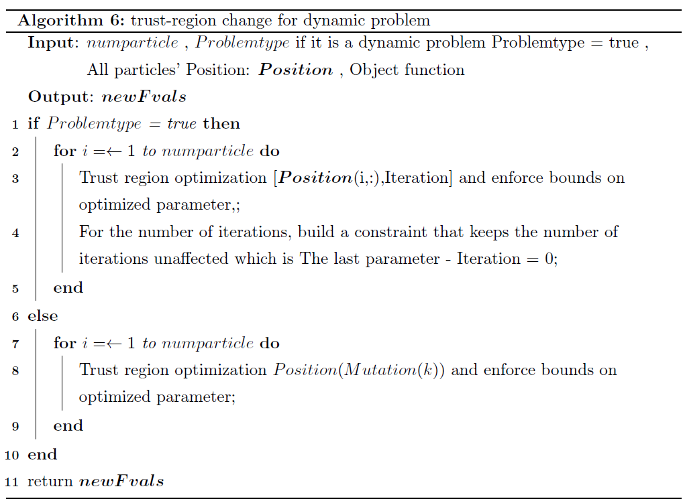

## 信赖域变异在动态问题求解中的作用

由于动态问题中目标函数$f(\boldsymbol{x},t)$的$t$会发生变动，于是在每一次迭代中目标函数都几乎会是一个全新的函数，但是由微分法可知在$t$的变化足够缓慢时($dt$)，我们可以将目标函数视为几乎没有变化($f(\boldsymbol{x},t+dt) - f(\boldsymbol{x},t) \to 0$)。

在$t$的变化为$dt$时，$f(\boldsymbol{x},t)$的变化为
$$
\begin{equation}
f(\boldsymbol{x},t+dt) = \frac{\partial f\left( \boldsymbol{x},t \right)}{\partial t}dt\,\,+\,\,f\left( \boldsymbol{x},t \right)
\end{equation}
$$
可见函数的变化是由$\frac{\partial f\left( \boldsymbol{x},t \right)}{\partial t}$ 与$dt$共同决定的，由于函数对于$t$的偏导数不尽相同，对于解空间的干扰比较难处理，但是函数变化后，其解空间发生相应的变化与$dt$ 是有直接关系的。下图展现了一种可能的解空间变化与$dt$之间的关系。

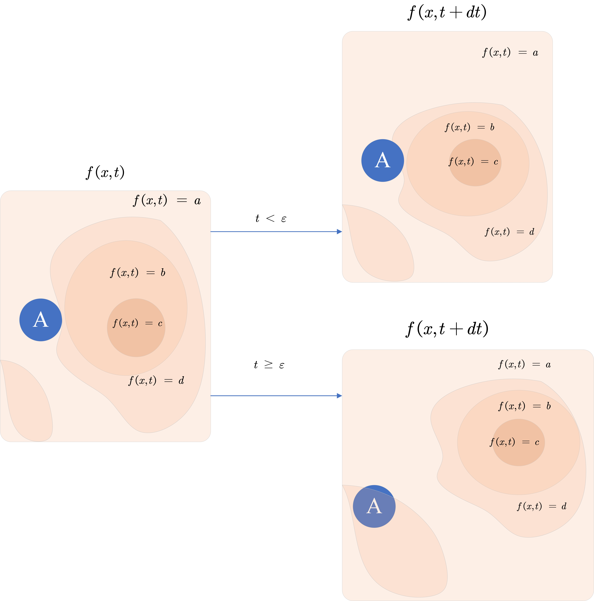

其对于解空间中局部最优解范围的影响由$dt$的大小决定，当$dt$小于某一阈值$\varepsilon$内时，当前粒子$A$进行信赖域变异时，仍然可以被其在上一次迭代中所处的局部最优解空间吸引，但若$dt$过大，会导致$A$不再能寻找到上一次所处的局部最优解空间，信赖域变异效果变差。

在动态问题中，对于信赖域变异方式的伪代码进行如Algorithm 7所示调整以便寻找局部最优解:

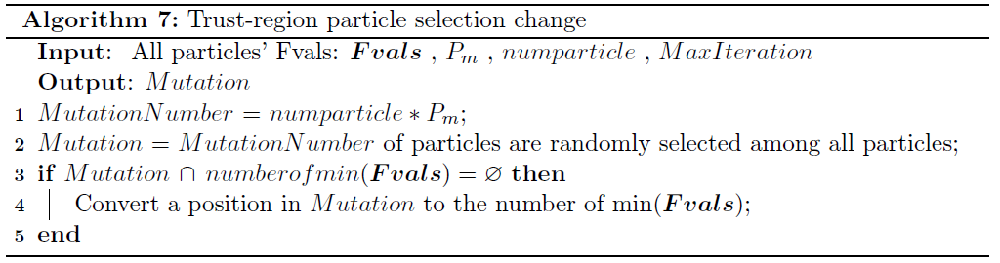

信赖域变异在动态问题中的长处便在于上一代的最优粒子$A$可以较为轻松地找到其上一次迭代所处的局部最优解，并且还有其他的几个随机粒子寻找其他地区的局部最优解，哪怕$A$所处的局部最优解在后来的迭代中恶化，其他粒子找到的新局部最优解也能代替$A$发挥作用。

### 对比

#### 设置

本文使用三种设置对于同一个动态问题进行求解，选择其最优解所构成的曲线进行对比。三种设置的对比如下表所示，由于篇幅限制，仅展示不同的部分。

|                    | Only PSO | Syntheticpso / Trust-region | Syntheticpso |
| ------------------ | -------- | --------------------------- | ------------ |
| Min Inertia        | 0.65     | 0.01                        | 0.01         |
| Max Inertia        | 0.65     | 1.3                         | 1.3          |
| Judge Trust-region | FALSE    | FALSE                       | TRUE         |
| Judge Anneal       | FALSE    | TRUE                        | TRUE         |
| Judge Cross        | FALSE    | TRUE                        | TRUE         |

Only PSO 表示最基本的PSO算法，Syntheticpso / Mutation表示变异不开启的综合粒子群算法，Syntheticpso表示除叠加态变异外均开启的综合粒子群算法。

#### 目标问题

目标问题为一个$f(\boldsymbol{x},t)$函数，其表达式为:
$$
\begin{equation}
f(\boldsymbol{x},t) = \frac{1}{4000}\sum_{i = 1}^{D} (x_i^2\sin{t}) - \prod_{i = 1}^{D}\cos\frac{x_i}{\sqrt{t}}
\end{equation}
$$
其中，$D=2$，$x_i$的上下界均为$[-10,10]$，$t = \frac{Iteration}{20}$，粒子群迭代次数设置为$500$代。

其目标函数的解空间变化如下所示

<video src="./image/Dynamic%20Function.mp4"></video>

#### 结果比较

对于目标问题进行优化后得到三组结果如下图所示:

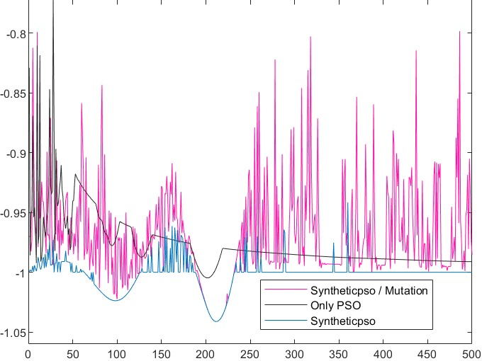

不难发现最基本的PSO算法比起加入了优化方式的PSO算法在处理动态问题上显得捉襟见肘，难以得到如另外两种算法所示的更优解。


不开启信赖域变异的综合粒子群算法虽然可以求得较优解但是极不稳定，很难保持最优状态。


而开启了信赖域变异的综合粒子群算法具有稳定，可以求得满意解等特点，在上图中出现剧烈波动的部分应当为之前所述的最优粒子丢失局部最优解的情况，但是在较短次数的迭代后，其他粒子可以接替之前的最优粒子继续寻找全局最优解来保持稳定，说明了信赖域变异在求解动态问题时具有一定的优越性。

根据附件的函数随时间变换的图像视频可以得到，进行了信赖域变异的综合粒子群算法在测试函数中绝大部分时间都可以稳定地找到全局最优解，而单纯粒子群算法或者变异不开启的综合粒子群算法都不能稳定地找到全局最优解或者容易陷入局部最优解。

# 参考文献

[1] H.-C. Wu, The karush{kuhn{tucker optimality conditions in an optimization problem with interval-valued objective function, European Journal of operational research 176 (1) (2007) 46{59.

# 附录

以下是综合粒子群算法的编译流程


